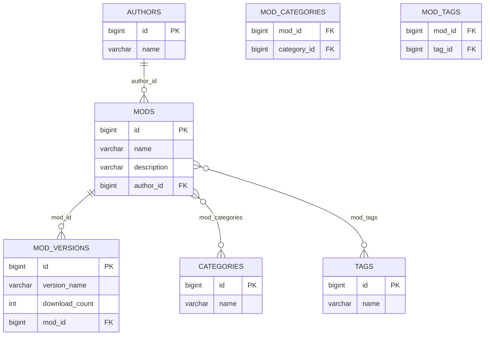

# Minecraft Mods Catalog

REST API-каталог модов для Minecraft на Spring Boot.

## Стек

- Java 21
- Spring Boot 4
- Spring Data JPA
- H2 (локальный профиль по умолчанию)
- PostgreSQL
- Maven

## Локальный запуск (по умолчанию)

По умолчанию приложение стартует с профилем `local` и in-memory БД H2.

Запуск:

```bash
./mvnw spring-boot:run
```

Консоль H2:

- `http://localhost:8081/h2-console`

## Настройка PostgreSQL

Для работы с PostgreSQL используйте профиль `postgres`:

```bash
./mvnw spring-boot:run -Dspring-boot.run.profiles=postgres
```

Параметры Postgres находятся в `src/main/resources/application-postgres.properties`:

- `spring.datasource.url=${DB_URL:jdbc:postgresql://localhost:5432/minecraft_mods}`
- `spring.datasource.username=${DB_USER:postgres}`
- `spring.datasource.password=${DB_PASSWORD:postgres}`

Перед запуском создайте БД:

```sql
create database minecraft_mods;
```

Быстрый старт через Docker:

```bash
docker compose up -d
```

Проверка, что БД готова:

```bash
docker ps
```

## Модель данных (5 сущностей)

- `Author`
- `Mod`
- `ModVersion`
- `Category`
- `Tag`

Связи:

- Один-ко-многим: `Author (1) -> (N) Mod`
- Один-ко-многим: `Mod (1) -> (N) ModVersion`
- Многие-ко-многим: `Mod (N) <-> (N) Category`
- Многие-ко-многим: `Mod (N) <-> (N) Tag`

## Решения по CascadeType и FetchType

- `Mod -> ModVersion`: `cascade = CascadeType.ALL`, `orphanRemoval = true`
  - Причина: версии полностью зависят от жизненного цикла мода.
- `Mod -> Author` (`ManyToOne`): без cascade, `FetchType.LAZY`
  - Причина: автор — общая справочная сущность, не должна удаляться/меняться вместе с модом.
- `Mod -> Category/Tag` (`ManyToMany`): без cascade, `FetchType.LAZY`
  - Причина: категории и теги — общие справочники.
- `LAZY` используется, чтобы не загружать весь граф сущностей в каждом запросе.

## Демонстрация N+1 и исправление

Эндпоинты:

- `GET /api/mods/nplus1/naive`
  - Наивный запрос + ленивые связи в mapper, приводит к N+1.
- `GET /api/mods/nplus1/entity-graph`
  - Использует `@EntityGraph(attributePaths = {"author", "categories", "tags", "versions"})`.

Чтобы увидеть разницу в SQL, в `application.properties` включено логирование SQL.

## CRUD

Сущность с полным CRUD: `Mod`

- `POST /api/mods`
- `GET /api/mods`
- `GET /api/mods/{id}`
- `PUT /api/mods/{id}`
- `DELETE /api/mods/{id}`

Фильтр по автору:

- `GET /api/mods?author=mezz`

## Транзакции (частичное сохранение vs rollback)

Оба метода сохраняют граф связанных сущностей.

- `POST /api/mods/demo/without-transaction`
  - Метод намеренно бросает исключение после сохранения **без** `@Transactional`.
  - Результат: часть/все данные остаются в БД при ответе с ошибкой.
- `POST /api/mods/demo/with-transaction`
  - Метод намеренно бросает исключение **с** `@Transactional`.
  - Результат: вся операция откатывается.

Пример тела запроса:

```json
{
  "name": "Sodium",
  "description": "Fast renderer",
  "authorName": "jellysquid3",
  "categoryNames": ["Optimization"],
  "tagNames": ["Fabric", "Popular"],
  "versions": [
    {"versionName": "0.5.9", "downloadCount": 200000},
    {"versionName": "0.6.0", "downloadCount": 250000}
  ]
}
```

## ER-диаграмма


